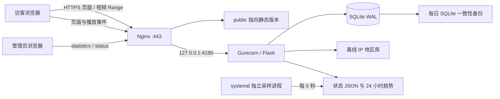

# GAASD 网站：技术实现、代码与维护

GAASD（Graphic AI-Augmented Software Developer）宣传网站及其访问统计、服务器状态后台。本地源码为 `D:\Code\GAASD-Web`，线上运行于腾讯云轻量应用服务器 `49.232.60.144`。网站、视频、统计和采集均在服务器运行，本机关机不影响线上服务。

本文按 **2026-09-24 实际源码和服务器配置**整理。统计口径详见 [STATISTICS.md](STATISTICS.md)，状态指标详见 [STATUS.md](STATUS.md)，完整备份与恢复详见 [BACKUP.md](BACKUP.md)。

代码备份仓库：[adamyjl/gaasd](https://github.com/adamyjl/gaasd)。**GitHub 仅保存源码、测试、构建/部署脚本、依赖清单和说明文件**，不上传视频、图片、PDF、地区数据库、访问数据、生产凭据或完整备份包。下文的目录结构描述完整本地项目；克隆仓库后须先恢复外部资源才能完整预览、构建和部署。具体步骤及资源校验清单见 [GitHub 代码备份说明](docs/github-backup.md)。

## 1. 入口与当前版本

“为什么需要 CBDES”评审中的新增前端与独立 Pages 预览见 [设计评审说明](docs/why-cbdes-review.md)。本功能分支不代表正式网站已上线，生产版本记录仍以以下表格为准。

| 地址                                | 内容                                                           | 权限       |
| ----------------------------------- | -------------------------------------------------------------- | ---------- |
| `https://gaasd.com/`                | 英文文案和封面；英文配音、上英下日字幕的总览；四个英文模块视频 | 公开       |
| `https://gaasd.com/cn/`             | 相同布局；中文文案、原封面、中文总览及四个中文模块视频         | 公开       |
| `https://gaasd.com/privacy.html`    | 英文数据用途说明、当前浏览器统计开关                           | 公开       |
| `https://gaasd.com/cn/privacy.html` | 中文数据用途说明、共用当前浏览器统计偏好                       | 公开       |
| `https://gaasd.com/statistics`      | 访问、IP 归属地、浏览器、视频播放报表与 CSV                    | 管理员     |
| `https://gaasd.com/status`          | CPU 各核心、内存、Swap、磁盘、网络、服务及趋势                 | 同一管理员 |
| `https://gaasd.com/healthz`         | Nginx 存活响应                                                 | 公开       |

HTTP 和 `www.gaasd.com` 以 308 跳转至 HTTPS 主域名；`/cn` 以 301 跳转至 `/cn/`。`http://49.232.60.144/gaasd-test/` 保留兼容预览，正式访问使用域名 HTTPS。主站文案、操作提示、无障碍标签及五张封面均为英文，备案号保留中文；中文站使用独立中文入口。

| 项目         | 当前值                                               |
| ------------ | ---------------------------------------------------- |
| SSH          | `ssh ubuntu@49.232.60.144`，使用已有 SSH 密钥        |
| 前端版本     | `/var/www/gaasd-test/releases/20260923T002235`       |
| 前端活动链接 | `/var/www/gaasd-test/public`                         |
| 后端版本     | `/opt/gaasd-analytics/releases/20260914T201120`      |
| 后端活动链接 | `/opt/gaasd-analytics/current`                       |
| Python 环境  | `/opt/gaasd-analytics/venv`，Python 3.12.3           |
| 系统         | Ubuntu 24.04、Nginx、systemd                         |
| 管理员       | 用户名 `gaasd-admin`；密码不写入源码或本文           |
| ICP 页脚     | `京ICP备2026057773号`，链接至工信部备案查询网站      |
| 公安备案页脚 | `京公网安备11010802050298号`，链接至公安备案查询页面 |

前后端版本可以不同：最近一次优化英文首屏的三行主标题、产品名称颜色层级及功能短语换行；延续英文文案和五张英文封面，四个模块标题与视频片头英文名称一致。十段中英文视频、中文站正文及后端保持原样。实际版本以 `readlink -f` 为准；`/healthz` 中的旧 `release` 字符串不是部署版本号。源码通过 Git 和 GitHub 备份；线上发布继续使用时间戳版本目录和 SHA-256 清单管理，推送 GitHub 不会自动部署。

公安备案链接为 `https://beian.mps.gov.cn/#/query/webSearch?code=11010802050298`，使用新窗口打开及 `noopener noreferrer`。备案图标保存在 `site/images/public-security-beian.png`，来源为备案平台自身使用的 `https://beian.mps.gov.cn/img/logo01.dd7ff50e.png`，网页从本站加载图片。电脑端备案号并排、手机端分行；发布和校验记录保存在 `work/public-security-20260915/`。

## 2. 整体架构



- **前端**：原生 HTML、CSS、ES Modules，无 React/Vue；Node.js 只用于构建、开发预览和测试，生产无需常驻 Node 服务。
- **视频**：Nginx 直接分发 MP4，浏览器原生 `<video>` 播放；支持 HTTP 206 范围请求和拖动，不经过 Flask，未接入 COS/CDN 或 HLS 转码。
- **后端**：Flask 3.1.3、Gunicorn 26.2.0，2 个 worker、每个 2 线程，仅监听 `127.0.0.1:4180`。
- **数据**：SQLite 持久化访问及播放；ip2region 离线解析 IP；ua-parser 解析浏览器；psutil 和 Linux procfs 采集系统状态。
- **认证**：Flask HTTP Basic，两个后台及其脚本、接口和导出共用 `GAASD Statistics` realm；生产配置保存密码哈希。
- **运维**：systemd 开机自启和失败重启；Let's Encrypt / certbot 自动续期。

## 3. 代码结构

```text
GAASD-Web/
├─ site/                         前端源码与运行媒体
│  ├─ index.html                 英文主站入口源码
│  ├─ cn/index.html              独立的中文入口源码，build 不覆盖
│  ├─ cn/privacy.html            中文数据说明及统计偏好入口
│  ├─ app.js                     初始化、传递媒体目录缓存版本
│  ├─ video-catalog.js           两种语言的五段视频及封面、时长、说明
│  ├─ data.js                    video-catalog.js 的兼容导出
│  ├─ cards.js / navigation.js   模块卡片、切换按钮、导航、手机菜单
│  ├─ player.js                  单一 video + dialog 播放器
│  ├─ analytics.js               第一方访问和播放事件采集
│  ├─ style.css                  响应式布局、主题、页脚
│  ├─ privacy.*                  英文数据说明和双语浏览器采集偏好逻辑
│  ├─ images/                    原中文封面、en/ 英文封面及公安备案图标
│  └─ media/                     原路径兼容媒体、present2 中英文媒体
├─ backend/
│  ├─ app.py                     事件接收、认证、报表、CSV、状态读取
│  ├─ database.py                表结构、事务、连接、初始化
│  ├─ geo.py / geo-data/         IPv4/IPv6 地区库、版本和许可证
│  ├─ status_collector.py        独立采样进程
│  ├─ backup.py                  每日数据库备份，保留最近 14 份
│  ├─ import_logs.py             一次性历史日志导入
│  ├─ refresh_agents.py          重新解析已有 User-Agent
│  ├─ dev_server.py              仅本地联调入口和测试账号
│  ├─ ui/                        statistics / status 页面、样式、脚本
│  ├─ tests/                     pytest 测试
│  └─ requirements.txt           生产 Python 直接依赖版本
├─ scripts/
│  ├─ build.mjs                  校验双语入口与媒体、复制到 dist、输出 SHA-256 清单
│  ├─ serve.mjs                  本地静态服务器、Range、后端代理
│  ├─ analytics-dev.mjs          启动本地 Python 后端
│  ├─ prepare-media.mjs          初始网页媒体准备
│  ├─ prepare-present2.mjs       1～4 中英文 MP4 校验、fast-start 无损重封装
│  ├─ prepare-geo.py             准备离线 IP 数据库
│  ├─ deploy.py                  已有服务器的完整静态发布
│  ├─ build-analytics-release.mjs 前端增量媒体和后端联合打包
│  ├─ deploy-analytics.py        联合发布、备份、服务配置、失败回退
│  ├─ backup_project.py          源码、原材料、网站媒体备份
│  ├─ backup_server.py           线上版本、配置、证书、数据库快照备份
│  ├─ backup_common.py           归档及校验公共实现
│  └─ verify_backup.py           跨平台完整读取校验
├─ tests/                        Playwright 页面、语言、统计和状态测试
├─ GAASD-Tutorial/               五段最初的原始视频
├─ GAASD-Develop.pdf、原图及示意图 源材料，纳入项目备份
├─ package.json / package-lock.json
├─ README.md / STATISTICS.md / STATUS.md / BACKUP.md
├─ dist/                         生成产物及 asset-manifest.json
├─ .tools/                       本地 Python / FFmpeg 等环境，不随备份复制
└─ work/                         临时发布包、测试数据、视频制作过程
```

模块桌面四列、平板两列、手机单列；390px 为左右卡片，320px 为上图下文。播放器切换时暂停旧视频，记录当前会话中的进度；关闭时释放请求、恢复焦点。封面灰度来自 CSS，视频本身保留彩色画面。

`site/index.html` 与 `site/cn/index.html` 分别维护两种语言的正文，共享 CSS 和 JavaScript。公共结构调整须同步两份入口；构建不会从英文页生成中文页。英文专用字体、字号和长标题换行通过 `html:lang(en)` 选择器处理，保留既有内容顺序和断点。

英文首屏使用一个 H1 和三个独立句子：`Decouple Software Layers`、`Reuse Proven Components`、`Refactor Visually With AI`。大小写直接写入文案，无句末标点。桌面文字/视频列比例为 47:53、列间距 40px，视频保持 16:9；1440px 标题约 48px，宽屏上限 49px，行高 1.16。宽屏桌面（1200px 起）及手机（767px 以下）的 H1 使用 `width: max-content` 和 `max-width: 100%`，以最长句的实际字宽限定共同宽度；每个块级 span 单独使用 `text-align: justify`、`text-align-last: justify` 和 `text-justify: inter-word`。三行字号、字重、字距相同，不缩放字形。768～1199px 保持原有左对齐。手机端使用 `clamp(22px, calc(8vw - 3.2px), 44px)`，将两侧各 20px 留白纳入字号计算；320px 及以上保持每句一行、三行两端对齐。

产品名称、斜杠、定位分别着色，功能短语使用两组可换行列表。每个短语保持完整，通过列表的负向前导间距和父级裁去装饰性行首分隔点，文字本身不裁切；不要把分隔点写进短语文本。新规则限定于英文 `.hero`，中文源码不变。主站 CSS 缓存版本为 `20260923-mobile-headline`。桌面标题对齐记录位于 `work/headline-align-20260923/`；后续手机两端对齐记录与截图位于 `work/mobile-headline-20260923/`，通过 320、360、375、390、414、430px 等 14 种视口检查及线上手机视频播放检查。当前回滚版本为 `/var/www/gaasd-test/releases/20260923T001628`。

首屏补充三个可直接阅读的缩写全称：顶部公式下方为 CBDES（Computing Base Brain & Development System）；两组产品标题下分别为 CBB（Computing Base Brain）和 GAASD（Graphic AI-Augmented Software Developer）。名称核对自 `GAASD-Develop.pdf` 第 1 页，GAASD 沿用已确认的 AI-Augmented 版本。全称使用 13px 次级灰色文字，手机端同样显示，不依赖悬停提示。更新记录、八种视口截图和检查结果位于 `work/acronyms-20260923/`；仅部署 `index.html` 和 `style.css`，回滚版本为 `/var/www/gaasd-test/releases/20260922T235627`。

## 4. 媒体映射与更新

路径相对于 `site/`，上线后相对于站点根目录。

| 视频             | 主站 `/`                                        | 中文站 `/cn/`                             | 时长               |
| ---------------- | ----------------------------------------------- | ----------------------------------------- | ------------------ |
| 总览             | `media/present2/en/overview-en-ja-20260914.mp4` | `media/overview.mp4`                      | 28.44 秒           |
| 1 平台与功能软件 | `media/present2/en/platform-20260915.mp4`       | `media/present2/cn/platform-20260915.mp4` | 03:27              |
| 2 AI 辅助开发    | `media/present2/en/ai-assist.mp4`               | `media/present2/cn/ai-assist.mp4`         | 03:14              |
| 3 神经网络开发   | `media/present2/en/nnide-20260916.mp4`          | `media/present2/cn/nnide-20260916.mp4`    | 英 04:56；中 04:43 |
| 4 VLM / VLA      | `media/present2/en/vla-20260916.mp4`            | `media/present2/cn/vla-20260916.mp4`      | 04:35              |

主站总览为 1080p / 50 fps、英文配音及上英下日字幕，SHA-256：`a228568afc631272e8d0b0ec283cf8331bb73f219cfc3bd5c01308c0a9f70b59`。中文总览 SHA-256：`7b64db3b60a0fbf4a19e1e666f5b90fefddd973db3032c80e47d185cf6b08a1a`。

模块 02 来自 `C:\Users\LG-NB\Downloads\present2`；模块 01 于 2026-09-15 更新为 Downloads 中的 `1. gaasd eng.mp4`（主站）和 `1. gaasd chn.mp4`（中文站）。模块 03、04 于 2026-09-16 更新为 `C:\Users\LG-NB\Downloads\gaasd0916` 中的四个新视频。仅做 H.264/AAC 校验及 fast-start 无损重封装，保留视频画面和配音。部署和恢复使用项目内媒体，不依赖 Downloads。旧的媒体地址保留兼容；替换主站总览时不要覆盖中文站仍在使用的 `media/overview.mp4`。

模块 01 的版本为 1920×1080、30 fps、207.04 秒，使用 `platform` 统计 ID；其发布记录保存在 `work/platform-20260915/`。

本次文件名中的“2. nnide”经确认对应网站 **03 神经网络开发**，不替换 02 AI 辅助开发。`2. nnide 英.mp4` 用于主站，`2. nnide 中.mp4` 用于中文站；`4. GAASD-VLA-English-Voice-EN-JA-Subtitles-Template-v2-Sound-Outro.mp4` 用于主站 VLA，`4. gaasd vla 中.mp4` 用于中文站 VLA。四段新视频均为 1920×1080、30 fps；NNIDE 英文 296.34 秒、中文 282.64 秒，VLA 两种语言均 274.81 秒。

上述媒体更新的来源文件、部署包、SHA-256 及校验记录位于 `work/media-20260916/`，统计 ID 仍为 `nnide` 和 `vla`，报表延续历史。

2026-09-22 的英文页面使用 `app.js?v=english-20260922`，参数同时传给动态加载的视频目录、卡片和播放器模块。主站封面位于 `site/images/en/*-20260922.webp`，中文站继续使用原图。图片采用 AI 局部编辑翻译界面文字并保留原构图，随后转为 WebP；这是宣传封面的本地化，不表示实际软件界面已改动。原始生成图、提示词及成品路径见 [英文封面制作记录](docs/english-covers-20260922.md)。

四个模块的英文名称以视频片头及用户提供的参考图为准，不另作意译：

| 模块              | 英文名称                                    |
| ----------------- | ------------------------------------------- |
| 01 平台与功能软件 | Graphical Development Platform Base         |
| 02 AI 辅助开发    | LLM-Assisted Graphical Development Platform |
| 03 神经网络开发   | Graphic Neural Network IDE                  |
| 04 VLM / VLA 开发 | Multimodal Model Development Platform       |

英文素材发布包、媒体不变校验和部署回执位于 `work/english-20260922/`。后续首屏排版更新记录位于 `work/hero-layout-20260922/`，包含修改前文件、截图、浏览器几何检查和部署回执；其上一版 `/var/www/gaasd-test/releases/20260922T231116` 保留供回滚。

```powershell
$env:GAASD_FFMPEG = 'C:\工具路径\ffmpeg.exe'
node scripts/prepare-present2.mjs 'C:/Users/LG-NB/Downloads/present2'
npm run build
```

更改媒体地址时修改 `video-catalog.js`，使用新文件名，同步更新两份入口的 `app.js?v=...` 版本参数，再 build。应用会把该参数传给视频目录、卡片和播放器模块，避免缓存继续使用旧地址或旧文案。

## 5. 接口与数据

| 方法与路径                                  | 功能 / 约束                                                 |
| ------------------------------------------- | ----------------------------------------------------------- |
| `POST /api/analytics/events`                | 页面及视频事件；Origin 白名单、8 KiB 请求体、字段与数值校验 |
| `GET /statistics/api/report`                | 管理员报表；日期、关键词、视频、来源、机器人、分页筛选      |
| `GET /statistics/api/export.csv`            | 管理员 CSV，UTF-8 BOM，每次最多 10,000 条                   |
| `GET /status/api/snapshot`                  | 管理员读取最新系统快照                                      |
| `GET /status/api/history`                   | 管理员读取 24 小时趋势                                      |
| `GET http://127.0.0.1:4180/internal/health` | 后端内部数据库、地区库健康检查                              |

Nginx 事件接口限流 10 次/秒、burst 60，管理接口 5 次/秒、burst 30。后端仅对本机受信代理读取 Nginx 覆盖的真实 IP 请求头，不采用客户端填写的 IP。后台禁用缓存和搜索引擎索引。

SQLite 使用 WAL 和事务。`visits` 保存访问、IP、地区、浏览器、页面路径和来源；`plays` 保存视频、实际观看时长、播放覆盖率；`legacy_media` 单独保存历史资源请求；`meta` 保存导入等元信息。部署不会清空数据库。

视频按实际播放推进计时，暂停、后台、缓冲和跳转距离不计入。每约 10 秒及关键播放器事件提交快照，乱序或重复上报按最大累计值更新。完成播放要求覆盖率至少 90% 且触发结束；历史 MP4 请求不当作真实播放。默认排除已识别机器人和 `GAASD-QA` 流量。独立 IP 不等于人数，IP 归属地不是精确住址。

前端尊重 Do Not Track 和隐私页开关，自动化浏览器默认不采集；Nginx 基本访问日志仍保留。`/` 与 `/cn/` 按访问路径区分，视频 ID 共用，汇总包含历史记录。更完整的口径和历史回填说明见 [STATISTICS.md](STATISTICS.md)。

状态独立进程每 5 秒采样，网页仅读取 JSON；每分钟聚合趋势，保留 24 小时。快照超过 20 秒提示过期。后台不提供重启或修改服务器的功能。整机或公网不可用时此页也可能不可达，不能替代外部监控。详见 [STATUS.md](STATUS.md)。

## 6. 本地开发与检查

已验证：Windows、Node.js 20.11.1、npm 10.2.4、Python 3.12、Google Chrome。前端依赖由 `npm ci` 按锁文件安装，Python 使用虚拟环境。

```powershell
Set-Location D:\Code\GAASD-Web
npm ci
python -m venv .tools/analytics-venv
& .tools/analytics-venv/Scripts/python.exe -m pip install -r backend/requirements.txt
& .tools/analytics-venv/Scripts/python.exe -m pip install pytest ruff
# 完整备份已包含地区库；只有缺少 .xdb 时才需要下一条
& .tools/analytics-venv/Scripts/python.exe scripts/prepare-geo.py
npm run dev
```

网页默认 `http://127.0.0.1:4173`。另开终端运行 `npm run dev:analytics` 启动 4180 后端，4173 代理后台路径。本地账号 `qa` / `local-test-only` 仅用于开发入口，生产不使用此账号。Windows 前端开发不需要启动 Linux 采样进程；状态接口无快照时会显示尚未准备好，状态测试使用独立预览快照。

```powershell
npm run format:check
npm run lint
npm run typecheck
npm run build
& .tools/analytics-venv/Scripts/python.exe -m pytest -q
& .tools/analytics-venv/Scripts/python.exe -m ruff check backend scripts
npm test
npx playwright test -c playwright.videos.config.mjs
npm run test:analytics
npx playwright test -c playwright.status.config.mjs
```

`build` 校验两份独立的 HTML 入口及两种语言媒体，复制源码到 `dist/` 并输出 `dist/asset-manifest.json`。浏览器测试前先 build，测试可自动启动本地服务。报告在 `playwright-report/` 及 `work/*-test-report/`，截图在对应 `work/` 子目录。移动端为 Chrome 模拟，不代表实体 iPhone/Safari 验收。

本次首屏排版更新通过 format:check、lint、typecheck、构建和本地页面测试（15 项通过、9 项重复检查按配置跳过）。发布后在 `https://gaasd.com` 通过全部 8 项双语视频与隐私页检查，以及 1920、1440、1024、390、320、768、1199、1200px 的首屏几何检查。中文桌面截图与修改前逐字节一致，无 JavaScript 异常；46 个部署文件校验通过，Nginx、统计和状态采集服务正常。截图及详细数值见 `work/hero-layout-20260922/online/`。现有后端测试集包含 37 项，本次未修改后端、未重跑后端测试。后续结果以实际最新运行输出为准。

## 7. 发布和回滚

仅改网页或视频用**完整静态发布**，同时修改后端用**联合发布**。以下脚本针对已经配置的服务器，不是空白服务器的一键安装器。

完整静态发布：

```powershell
npm run build
$release = Get-Date -Format 'yyyyMMddTHHmmss'
tar.exe -cf "work/gaasd-release-$release.tar" -C dist .
scp "work/gaasd-release-$release.tar" ubuntu@49.232.60.144:/tmp/
scp scripts/deploy.py ubuntu@49.232.60.144:/tmp/gaasd-deploy.py
ssh ubuntu@49.232.60.144 "sudo python3 /tmp/gaasd-deploy.py $release"
```

前后端联合发布：

```powershell
npm run build
$release = Get-Date -Format 'yyyyMMddTHHmmss'
node scripts/build-analytics-release.mjs $release
scp "work/gaasd-analytics-$release.tar" ubuntu@49.232.60.144:/tmp/
scp scripts/deploy-analytics.py ubuntu@49.232.60.144:/tmp/gaasd-deploy-analytics.py
ssh ubuntu@49.232.60.144 "sudo python3 /tmp/gaasd-deploy-analytics.py $release"
```

静态发布核验所有 SHA-256、检查 Nginx，再原子切换 `public`，不改数据库或后端。联合发布先备份配置和数据库，创建版本、检查后端和采集服务，再切换；失败时尝试恢复原配置和版本。联合包包含 `media/present2/` 和 `images/en/`，复用服务器已有的原中文总览、兼容媒体及原封面。

不要原地修改已发布版本。静态回滚将 `public` 原子切回旧目录；后端回滚需匹配配置并重启服务，数据库恢复另行处理。完整步骤见 [BACKUP.md](BACKUP.md)。

```powershell
$env:GAASD_TEST_URL = 'https://gaasd.com'
npx playwright test -c playwright.videos.config.mjs
Remove-Item Env:GAASD_TEST_URL
```

生产测试会下载真实视频、占用流量，应按变更范围选择检查。

## 8. 运维位置与排查

| 路径 / 服务                                   | 用途                                 |
| --------------------------------------------- | ------------------------------------ |
| `/etc/nginx/sites-available/gaasd-test`       | 域名、HTTP/HTTPS、证书、静态根目录   |
| `/etc/nginx/snippets/gaasd-analytics.conf`    | 事件、statistics、status 代理        |
| `/etc/nginx/conf.d/gaasd-analytics-rate.conf` | 限流区域                             |
| `/etc/gaasd-analytics/config.json`            | 数据路径、账号哈希、来源和代理设置   |
| `/etc/gaasd-analytics/admin-credentials.json` | 初始管理员登录信息，root-only        |
| `/var/lib/gaasd-analytics/analytics.sqlite3`  | 持久统计数据库                       |
| `/var/lib/gaasd-analytics/status/`            | latest.json、history.json            |
| `/var/lib/gaasd-analytics/backups/`           | 最近 14 份每日数据库备份             |
| `/etc/letsencrypt/live/gaasd.com/`            | HTTPS 证书链接                       |
| `/var/log/nginx/gaasd-test.access.log*`       | 请求日志，每日轮换、保留 14 份       |
| `gaasd-analytics.service`                     | Flask/Gunicorn，非特权用户运行       |
| `gaasd-status-collector.service`              | 独立采样，192 MiB 内存、20% CPU 配额 |
| `gaasd-analytics-backup.timer`                | 每天服务器北京时间 03:15 数据库备份  |
| `certbot.timer`                               | 证书续期                             |

```bash
readlink -f /var/www/gaasd-test/public
readlink -f /opt/gaasd-analytics/current
sudo nginx -t
systemctl is-active nginx gaasd-analytics gaasd-status-collector
sudo journalctl -u gaasd-analytics.service -n 50
sudo journalctl -u gaasd-status-collector.service -n 50
curl --fail http://127.0.0.1:4180/internal/health
sudo systemctl list-timers gaasd-analytics-backup.timer certbot.timer
```

404 核对活动目录和资源路径；视频不能拖动检查 Range 是否返回 206；502 检查 Gunicorn；状态过期检查 collector；地区缺失检查 geo-data；HTTPS 失败检查证书及 certbot 日志。

## 9. 完整备份

2026-09-24 当前网站的完整备份集为 **`20260924T102025`**，本地目录 **`D:\Code\GAASD-Web-Backups\20260924T102025\`**，服务器目录 **`/var/backups/gaasd-web/full/20260924T102025/`**。两端保存同一组源码包、运行快照包及 SHA-256 校验文件，不放入网站公开目录。本次覆盖英文文案和封面、中英文最新视频、桌面与手机标题两端对齐，以及统计和状态后台；前端版本为 `20260923T002235`，后端版本为 `20260914T201120`。备份目录中的 `backup-set.json` 记录实际校验结果及快照时间。

历史完整备份 **`20260914T213529`** 继续保留在两端原目录，不覆盖。这是模块 01 于 2026-09-15 更新前的旧快照；恢复当前网站应使用最新备份集。

项目包包含源码、锁文件、运行媒体、原始视频/PDF/图片、文档和测试。运行包包含当前实际部署版本、SQLite 在线一致性快照、状态历史、每日数据备份、Nginx、systemd、管理员配置和 HTTPS 证书。它是应用级快照，不是腾讯云整机镜像。

依赖目录、虚拟环境、临时 work、模型缓存和重复测试报告不打包，依赖可按锁文件重建。Downloads 中的 present2 不另存副本，项目内已包含运行所需视频。完整运行备份含 IP 数据、管理员凭据和证书私钥，保存在受限目录。

整站备份为本次手动快照；既有每日数据库备份继续运行，并不会自动每天复制整站到本机。后续重复备份、校验、双端保存和恢复见 [BACKUP.md](BACKUP.md)。
