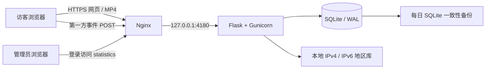

# GAASD 访问与视频统计

统计页：<https://gaasd.com/statistics>。访问页面、接口和 CSV 均需管理员登录。管理员账号为 `gaasd-admin`，生成的密码保存在服务器 `/etc/gaasd-analytics/admin-credentials.json`，以及本机交付的登录信息文件中。密码不在网站代码或公开目录中。

## 功能与统计口径

- 访问明细：服务器收到请求的北京时间、IP、IP 大致归属地、运营商、浏览器与版本、操作系统、设备、来源页面、页面路径。
- 视频明细：总览及四个开发模块，实际播放次数、前台累计观看时长、播放覆盖比例、完整播放次数。
- 汇总：PV、会话、独立 IP、播放次数、累计时长、逐日趋势、地区和浏览器分布。
- 可按日期、IP / 地区 / 浏览器文字、关联视频、数据来源筛选，支持分页和 CSV 导出（每次最多 10,000 条）。
- 默认排除通过 User-Agent 识别出的机器人、抓取工具和带 `GAASD-QA` 标记的验收流量；不能保证识别所有自动流量。

**访问次数**按唯一页面实例记录，刷新计为新访问。页面会话采用标签页临时标识，30 分钟不活动后再次访问生成新会话；历史会话按 IP 与浏览器、30 分钟间隔推断。独立 IP 不等同于人数。

**播放次数**在 video 实际开始播放后记录。同一弹窗中暂停 / 继续不会重复计次，重新打开或切换再播放会产生新播放记录。累计时长按前台实际推进的播放时间累积，后台、暂停、缓冲和跳转距离不计入。每约 10 秒以及暂停、关闭、页面隐藏时提交快照；累计值采用最大值更新，重复上报和乱序不会叠加时长。时间精度为近似值，受事件采样及离线中断影响。

**完整播放**要求原生 video 的已播放区间覆盖至少 90%，并触发播放结束；直接拖动到结尾不算完整播放。

**关联视频筛选**选出有该视频播放或历史资源请求的访问记录，汇总会随这个访客记录集合变化，明细仍展示这些访问中关联的全部视频。

## 历史数据

2026-09-10 20:02:52（北京时间）完成历史截止与采集启用，导入此前现有 `gaasd-test.access.log*` 中 57 条成功页面访问及 124 条成功视频资源请求。HEAD、资源静态文件和错误请求不计 PV。重复导入会跳过，后续采集不会与该次历史回填重复。

历史记录明确标为“历史日志”。这些日志不能还原真正播放时间、观看时长或完整播放率，视频请求也可能来自浏览器范围请求、预取或下载，因此它们不计入实际播放次数。按时间和 IP / 浏览器关联的视频请求单列展示；未能关联页面访问的请求保留在数据库中，但不计入按访问明细汇总的关联请求数。

截至 2026-09-10 20:07:47，默认近 7 天筛选且排除已识别自动流量时，显示 47 次历史访问、37 个推断会话、29 个不同 IP、99 次关联的历史视频资源请求。此时还没有普通访客的新播放事件；上线验证产生的 QA 事件单独标记为自动流量。

## 线上架构



公网仅由原 Nginx 提供 HTTPS；Gunicorn 监听服务器本机地址，使用专门的 `gaasd-analytics` 系统用户。Nginx 覆盖真实 IP 请求头，客户端填写的 IP 字段和伪造的 X-Real-IP 不作为统计 IP。事件接口限制请求体、类型、字段与来源域名，并设置限流。

统计数据、服务和备份均在腾讯云服务器，不依赖本机或 Codex 进程。原首页、视频、证书续期和其他反向代理继续使用原部署。

后端采用官方 Flask 推荐的 Gunicorn + 反向代理方式。[Flask 部署文档](https://flask.palletsprojects.com/en/stable/deploying/gunicorn/)

IP 地区使用 ip2region 官方离线 IPv4 / IPv6 数据，在服务器内解析，不向第三方发送访问者 IP。地区库可能不完整或滞后，位置只能近似推断，不提供 GPS 或精确住址。数据版本与校验记录在 `backend/geo-data/source.json`，许可证一并保存。[ip2region 官方项目](https://github.com/lionsoul2014/ip2region)

## 目录与运行服务

本地项目：`D:\Code\GAASD-Web`。

| 路径 / 服务                                                | 用途                                    |
| ---------------------------------------------------------- | --------------------------------------- |
| `site/analytics.js`                                        | 第一方页面、视频事件采集                |
| `site/player.js`、`site/app.js`                            | 接入播放器生命周期与初始化              |
| `site/privacy.html`、`site/privacy.js`、`site/privacy.css` | 数据用途说明与本浏览器事件关闭偏好      |
| `backend/app.py`                                           | 采集、管理员认证、报表与导出            |
| `backend/database.py`                                      | SQLite 模型及事务                       |
| `backend/geo.py`                                           | 离线地区及浏览器解析                    |
| `backend/import_logs.py`                                   | 一次性历史回填                          |
| `backend/refresh_agents.py`                                | 浏览器解析更新后重新标注原始 User-Agent |
| `backend/backup.py`                                        | 每日数据库备份                          |
| `backend/ui/`                                              | 统计页 HTML / CSS / JavaScript          |
| `/opt/gaasd-analytics/current`                             | 当前后端版本                            |
| `/etc/gaasd-analytics/config.json`                         | 受限配置与密码哈希                      |
| `/var/lib/gaasd-analytics/analytics.sqlite3`               | 持久统计数据库                          |
| `/var/lib/gaasd-analytics/backups/`                        | 最近 14 份每日备份                      |
| `gaasd-analytics.service`                                  | 后端服务，开机自启，失败重启            |
| `gaasd-analytics-backup.timer`                             | 每日 03:15 数据备份                     |

主数据库持续保存访问记录，不随站点版本发布清空。备份保留 14 个日期副本，轮替旧备份不删除主数据库里的历史记录。访问与日志数据没有被放入静态网页目录。

## 本地开发和验收

```powershell
# 先准备 Python 3.12 虚拟环境与依赖。
python -m venv .tools/analytics-venv
& .tools/analytics-venv/Scripts/python.exe -m pip install -r backend/requirements.txt
& .tools/analytics-venv/Scripts/python.exe -m pip install pytest ruff
& .tools/analytics-venv/Scripts/python.exe scripts/prepare-geo.py

npm ci
npm run dev:analytics
# 另一终端运行网页预览
npm run dev
```

本地预览使用 `http://127.0.0.1:4173/statistics`，仅本机监听；测试账号 `qa`、密码 `local-test-only` 属于未部署的 `backend/dev_server.py`，生产环境从受限配置读管理员账号，缺失配置时拒绝启动。

```powershell
npm run format:check
npm run lint
npm run typecheck
npm run build
npm test
npm run test:analytics
& .tools/analytics-venv/Scripts/python.exe -m ruff check backend scripts/deploy-analytics.py scripts/prepare-geo.py
& .tools/analytics-venv/Scripts/python.exe -m pytest -q
```

测试覆盖宣传页、统计页桌面 / 390px / 320px 布局、登录、筛选、明细、CSV 和播放埋点；当前统计与状态合计 37 项后端测试。具体以最新命令运行结果为准。跨项目重复用例会明确跳过，移动端使用 Chrome 模拟。整站运行方式、媒体映射和完整备份入口见 [README.md](README.md)。

公网验收通过真实域名运行。生产采集验收使用 `GAASD-QA` User-Agent，默认不进入普通流量统计，验证实际播放写入和伪造 IP 请求头不能覆盖服务器 IP。

## 更新发布

```powershell
npm run build
$release = Get-Date -Format 'yyyyMMddTHHmmss'
node scripts/build-analytics-release.mjs $release
scp "work/gaasd-analytics-$release.tar" ubuntu@49.232.60.144:/tmp/
scp scripts/deploy-analytics.py ubuntu@49.232.60.144:/tmp/gaasd-deploy-analytics.py
ssh ubuntu@49.232.60.144 "sudo python3 /tmp/gaasd-deploy-analytics.py $release"
```

发布脚本先验证文件校验和，再准备独立版本目录、数据库备份、服务与 Nginx 路由。前端复用原有视频与图片并按清单核验。后端健康检查及 Nginx 配置检查通过后，才切换站点链接并重载 Nginx。

首次统计版本为 `20260910T200028`，当日后续版本为 `20260910T201140`；当前前后端活动版本以 [README.md](README.md) 及服务器链接为准。联合发布的配置和数据库备份位于 `/var/backups/gaasd-analytics-<版本>/`。后续发布保留管理员凭据和数据库，不重复导入历史日志。完整源码与运行快照的双端备份见 [BACKUP.md](BACKUP.md)。

服务检查：

```bash
sudo systemctl status gaasd-analytics.service
sudo systemctl list-timers gaasd-analytics-backup.timer
sudo journalctl -u gaasd-analytics.service -n 50
sudo nginx -t
```

首页末尾的“访问与播放统计说明”提供数据用途说明。关闭事件统计或开启 Do Not Track 后，不上报后续页面和播放事件；基本服务器访问日志仍会保留。
